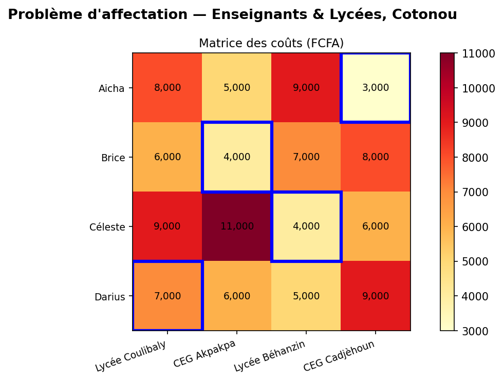

# Problème d'affectation — Enseignants & Lycées, Bénin

Optimisation de l'affectation de 4 enseignants vacataires à 4 établissements 
secondaires autour de Cotonou, modélisée comme un problème d'affectation 
et résolue avec PuLP.

## Contexte

Une université de la place doit affecter des enseignants à des lycées en minimisant les coûts 
de déplacement hebdomadaires. Ce problème illustre une situation réelle 
de gestion des ressources humaines dans le système éducatif béninois.

## Modèle

- **Type** : Programmation linéaire en nombres entiers (PLNE)
- **Variables** : binaires — $x_{ij} \in \{0,1\}$
- **Objectif** : minimiser le coût total de déplacement
- **Contraintes** : chaque enseignant affecté à exactement un établissement, 
  chaque établissement reçoit exactement un enseignant

## Résultat

| Enseignant | Établissement    | Coût      |
|------------|-----------------|-----------|
| Aicha      | CEG Cadjèhoun   | 3,000 FCFA|
| Brice      | CEG Akpakpa     | 4,000 FCFA|
| Céleste    | Lycée Béhanzin  | 4,000 FCFA|
| Darius     | Lycée Coulibaly | 7,000 FCFA|
| **Total**  |                 | **18,000 FCFA** |

## Visualisation

## Stack

- Python 3
- PuLP
- Matplotlib
- NumPy